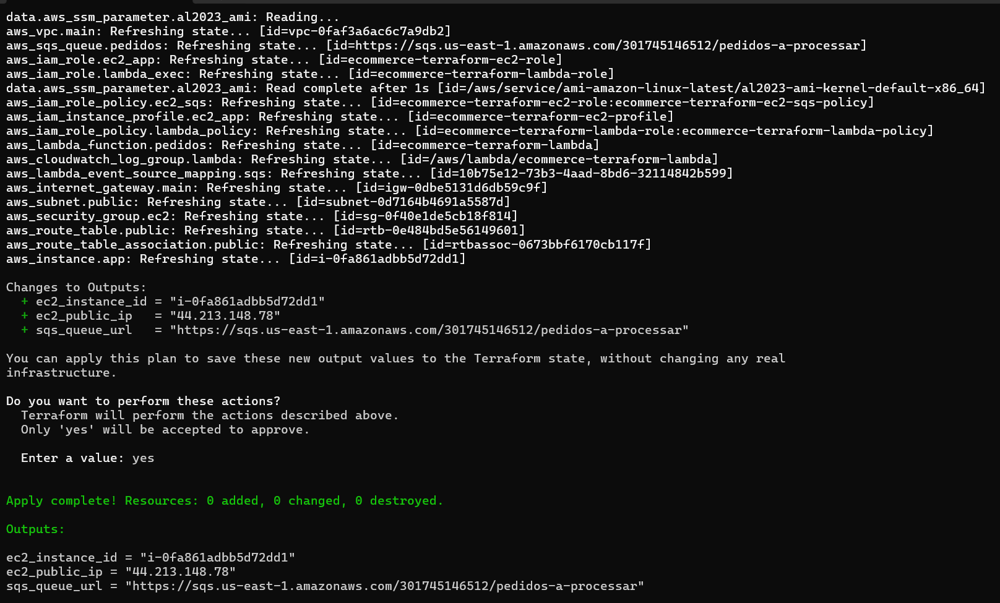
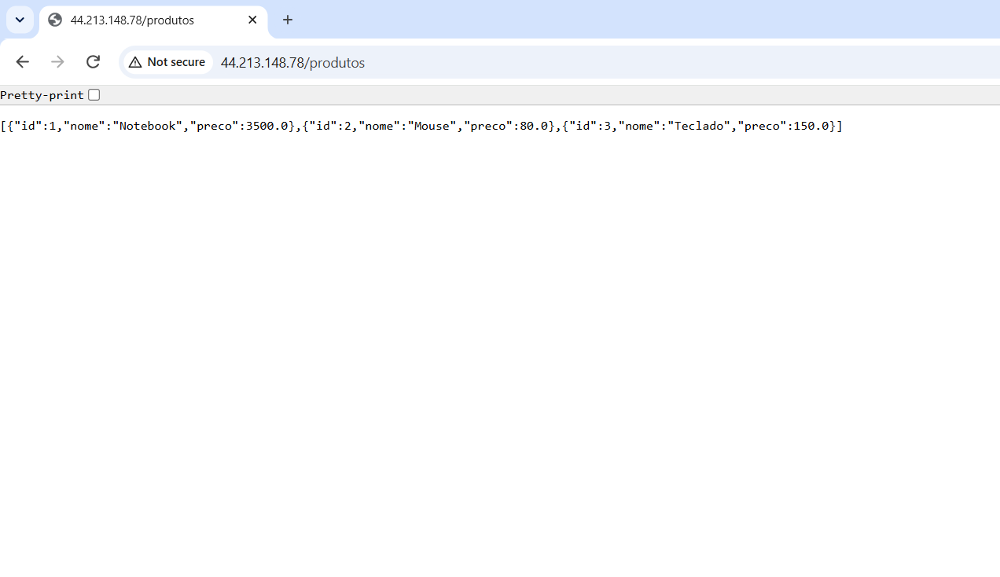
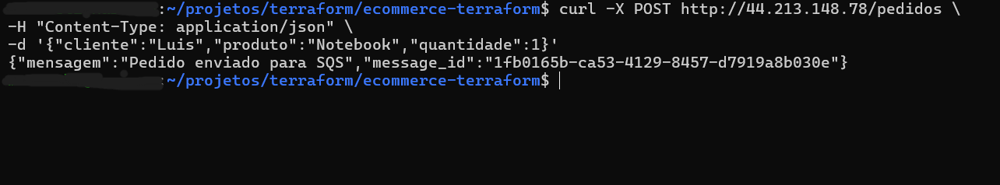
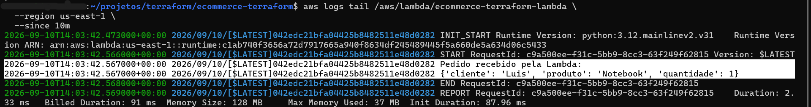
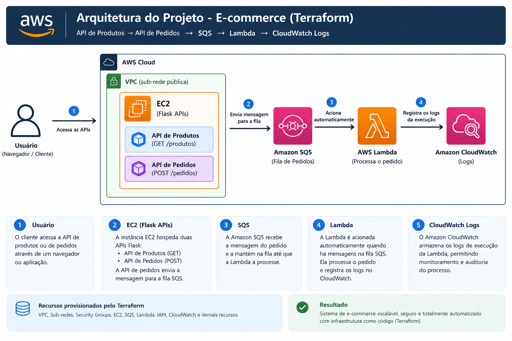
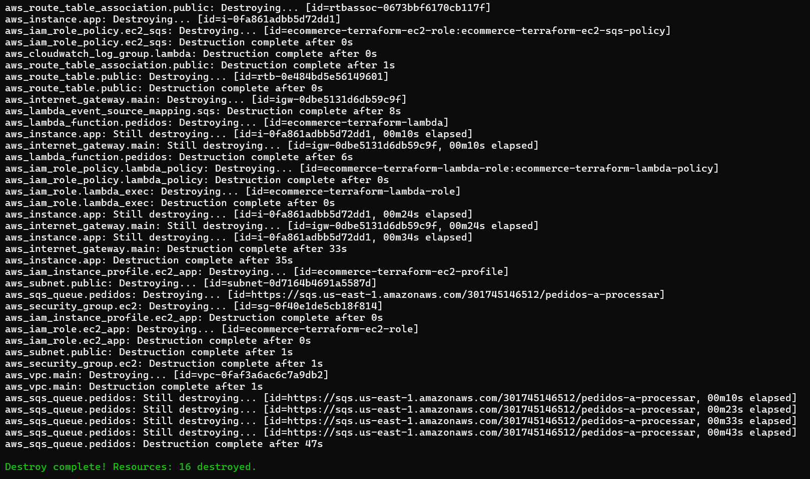

# E-commerce AWS com Terraform

Projeto de infraestrutura em nuvem desenvolvido com **Terraform**, utilizando serviços da **Amazon Web Services (AWS)** para simular uma arquitetura de e-commerce baseada em APIs, processamento assíncrono e arquitetura serverless.

## Sobre o projeto

O projeto faz parte da atividade final do módulo avançado do Capacita iRede. 
Para concluir esta etapa da formação e avançar para a próxima fase da jornada, o estudante foi desafiado a atuar como desenvolvedor de infraestrutura na construção de uma solução de e-commerce na AWS.
O foco principal do projeto é criar toda a infraestrutura utilizando **Infraestrutura como Código (Terraform)**, simulando uma arquitetura moderna baseada em microsserviços e comunicação assíncrona.
O objetivo é projetar e implementar uma infraestrutura capaz de suportar duas aplicações: uma API de Produtos e uma API de Pedidos. Além disso, a solução deverá contemplar um fluxo simples de mensageria entre os serviços.

Portanto a finalidade deste projeto é provisionar, através de **Infrastructure as Code (IaC)**, uma infraestrutura AWS capaz de executar duas APIs e processar pedidos de forma assíncrona.

A arquitetura implementada utiliza:

**Usuário → EC2 → SQS → Lambda → CloudWatch Logs**

Toda a infraestrutura é criada e gerenciada utilizando Terraform, permitindo que os recursos fossem criados de maneira automatizada e reproduzível.

---

## Arquitetura

A solução desenvolvida consiste em uma arquitetura de e-commerce hospedada na AWS, provisionada integralmente utilizando Terraform, seguindo o conceito de Infrastructure as Code (IaC). 
Ela foi projetada para demonstrar a integração entre serviços de computação, rede, mensageria, processamento serverless e monitoramento.
É composta pelos seguintes componentes:

* **Amazon VPC** — rede virtual do projeto
* **Subnet pública** — permite acesso à aplicação
* **Internet Gateway** — comunicação com a Internet
* **Route Table** — roteamento da subnet pública
* **Security Group** — controle de acesso da EC2
* **Amazon EC2** — execução das APIs
* **Amazon SQS** — fila para processamento assíncrono dos pedidos
* **AWS Lambda** — processamento das mensagens recebidas
* **Amazon CloudWatch Logs** — registro da execução da Lambda

### Fluxo da aplicação

```text
Usuário
   │
   ▼
EC2
   │
   ├── API de Produtos
   │
   └── API de Pedidos
           │
           ▼
      Amazon SQS
           │
           ▼
      AWS Lambda
           │
           ▼
   CloudWatch Logs
```


---
## Tecnologias utilizadas

* Terraform
* AWS
* Amazon VPC
* Amazon EC2
* Amazon SQS
* AWS Lambda
* Amazon CloudWatch
* Python
* Flask
* Boto3
* Linux

---

## Estrutura do projeto

```text
ecommerce-terraform/
│
├── main.tf
├── variables.tf
├── vpc.tf
├── security.tf
├── ec2.tf
├── sqs.tf
├── lambda.tf
├── outputs.tf
├── user_data.sh
├── README.md
├── .gitignore
│
├── app/
│   ├── lambda_function.py
│   ├── produtos/
│   │   └── app.py
│   └── pedidos/
│       └── app.py
│
└── evidencias/
    ├── 01-terraform-apply.png
    ├── 02-api-produtos.png
    ├── 03-api-pedidos-sqs.png
    ├── 04-lambda-cloudwatch.png
    ├── 05-arquitetura.png
    └── 06-terraform-destroy.png
```

---

## Recursos provisionados

### Rede

A infraestrutura é iniciada por uma Amazon VPC, responsável por fornecer uma rede virtual isolada para os recursos da aplicação.
Dentro da VPC foi criada uma subnet pública, configurada para atribuir endereços IP públicos às instâncias. 
Para permitir a comunicação entre a infraestrutura e a Internet, foi utilizado um Internet Gateway.
Também foi criada uma Route Table contendo uma rota padrão (0.0.0.0/0) direcionada ao Internet Gateway. 
Essa configuração permite que a instância EC2 receba requisições externas e tenha conectividade com a Internet.

A infraestrutura de rede é criada através do arquivo `vpc.tf`.

São provisionados:

* VPC
* Subnet pública
* Internet Gateway
* Route Table
* Associação da Route Table com a subnet

A VPC utiliza o CIDR:

```text
10.0.0.0/16
```

A subnet pública utiliza:

```text
10.0.1.0/24
```

---

### Segurança

Foi configurado um Security Group associado à instância EC2 para controlar o tráfego de entrada e saída.
O arquivo `security.tf` cria o Security Group utilizado pela instância EC2.

São permitidas conexões:

| Protocolo | Porta | Finalidade           |
| --------- | ----: | -------------------- |
| HTTP      |    80 | Acesso às APIs       |
| SSH       |    22 | Administração da EC2 |

A instância também possui permissões IAM para enviar mensagens para a fila SQS.

**Observação:** a abertura de SSH para `0.0.0.0/0` foi utilizada neste projeto para fins de laboratório. Em um ambiente de produção, o acesso SSH deve ser restringido a endereços IP confiáveis ou substituído por mecanismos mais seguros.

---

## EC2 e APIs

A camada de computação utiliza uma instância Amazon EC2, provisionada automaticamente pelo Terraform.
A instância executa duas APIs desenvolvidas em Python com Flask:
API de Produtos: disponibiliza uma lista de produtos por meio de uma requisição HTTP.
API de Pedidos: recebe os dados de um pedido e encaminha essas informações para a fila SQS.

Dessa forma:
/produtos → API de Produtos
/pedidos → API de Pedidos

A instância EC2 utiliza **Amazon Linux 2023** e é provisionada automaticamente pelo Terraform.

O `user_data.sh` realiza automaticamente:

1. Atualização do sistema
2. Instalação do Python
3. Instalação do Flask e Boto3
4. Instalação e configuração do Nginx
5. Criação das APIs
6. Criação dos serviços `systemd`
7. Inicialização das aplicações

### API de Produtos

Endpoint:

```text
GET /produtos
```

Exemplo de resposta:

```json
[
  {
    "id": 1,
    "nome": "Notebook",
    "preco": 3500.0
  },
  {
    "id": 2,
    "nome": "Mouse",
    "preco": 80.0
  },
  {
    "id": 3,
    "nome": "Teclado",
    "preco": 150.0
  }
]
```

### API de Pedidos

Endpoint:

```text
POST /pedidos
```

Exemplo de requisição:

```bash
curl -X POST http://IP_DA_EC2/pedidos \
-H "Content-Type: application/json" \
-d '{"cliente":"Luis","produto":"Notebook","quantidade":1}'
```

A API envia o pedido para a fila SQS.

---

## Processamento assíncrono com SQS

A Amazon Simple Queue Service (SQS) foi utilizada como mecanismo de mensageria assíncrona entre a API de pedidos e a função Lambda.
A utilização do SQS permite desacoplar o recebimento do pedido do seu processamento posterior. 
Dessa forma, a API não precisa executar diretamente o processamento realizado pela Lambda.

A fila utilizada pelo projeto é:

```text
pedidos-a-processar
```

Quando um pedido é criado através da API, a aplicação envia uma mensagem para a fila SQS.

O fluxo é:

```text
API de Pedidos
      ↓
Amazon SQS
      ↓
AWS Lambda
```

Esse modelo permite separar o recebimento do pedido do seu processamento.

---

## AWS Lambda

A AWS Lambda é responsável por consumir e processar as mensagens disponibilizadas na fila SQS.
Ela foi configurada no Terraform com um trigger do SQS. Quando uma nova mensagem é disponibilizada na fila, a AWS aciona automaticamente a função Lambda.
A função recebe o evento, extrai os dados do pedido e registra as informações no log, simulando o processamento de um pedido de e-commerce.
Ela recebe os eventos enviados pelo SQS e registra os pedidos nos logs.

Exemplo:

```text
Pedido recebido pela Lambda:
{'cliente': 'Luis', 'produto': 'Teclado', 'quantidade': 2}
```

O código da função está localizado em:

```text
app/lambda_function.py
```

O pacote da Lambda é gerado automaticamente pelo Terraform utilizando o provider `archive`.

---

## CloudWatch Logs

Os registros gerados pela função Lambda são armazenados no Amazon CloudWatch Logs.
Essa integração permite acompanhar a execução da função e verificar se as mensagens enviadas pela API estão sendo processadas corretamente.
Durante os testes, foi possível observar no CloudWatch os dados dos pedidos recebidos pela Lambda, comprovando o funcionamento do fluxo assíncrono.
As execuções da Lambda são registradas automaticamente no Amazon CloudWatch Logs.

O projeto cria o grupo:

```text
/aws/lambda/ecommerce-terraform-lambda
```

A retenção configurada para os logs é de **7 dias**.

---

# Como executar o projeto

## 1. Pré-requisitos

É necessário possuir:

* Conta AWS
* AWS CLI configurado
* Terraform instalado
* Credenciais AWS configuradas
* Key Pair disponível na região utilizada

Verifique o Terraform:

```bash
terraform version
```

Verifique a identidade AWS:

```bash
aws sts get-caller-identity
```

---

## 2. Inicializar o Terraform

Dentro do diretório do projeto:

```bash
terraform init
```

O comando instala os providers necessários para o projeto.

---

## 3. Validar a configuração

```bash
terraform validate
```

Resultado esperado:

```text
Success! The configuration is valid.
```

---

## 4. Visualizar o plano

```bash
terraform plan
```

Esse comando apresenta os recursos que serão criados, alterados ou destruídos.

---

## 5. Criar a infraestrutura

```bash
terraform apply
```

Confirme digitando:

```text
yes
```

Ao final, o Terraform apresenta os outputs, incluindo o IP público da EC2 e a URL da fila SQS.

---

# Como acessar a aplicação

Após o `terraform apply`, obtenha o IP público da EC2:

```bash
terraform output -raw ec2_public_ip
```

Para acessar a API de produtos:

```text
http://IP_DA_EC2/produtos
```

Para testar a API de pedidos:

```bash
curl -X POST http://IP_DA_EC2/pedidos \
-H "Content-Type: application/json" \
-d '{"cliente":"Luis","produto":"Notebook","quantidade":1}'
```

---

# Testando o fluxo completo

O fluxo pode ser validado seguindo estas etapas:

### 1. Acessar a API de Produtos

```text
GET /produtos
```

### 2. Criar um pedido

```text
POST /pedidos
```

### 3. Verificar a mensagem no SQS

A API retorna um `message_id` após enviar o pedido para a fila.

### 4. Lambda processa a mensagem

A Lambda é acionada automaticamente pelo SQS.

### 5. Verificar o CloudWatch

Os logs da Lambda mostram o pedido recebido e processado.

Fluxo final:

```text
Usuário
   ↓
EC2
   ↓
API de Pedidos
   ↓
SQS
   ↓
Lambda
   ↓
CloudWatch Logs
```

---

# Evidências

## Terraform Apply

Evidência da criação da infraestrutura através do Terraform:



---

## API de Produtos

Evidência da API de produtos funcionando na EC2:



---

## API de Pedidos → SQS

Evidência do envio de um pedido para a fila SQS:



---

## Lambda → CloudWatch

Evidência do processamento automático do pedido pela Lambda e registro no CloudWatch:



---

## Arquitetura

Diagrama da arquitetura implementada:

**Observação:** Diagrama criado por Inteligência Artificial



---

## Terraform Destroy

Após a conclusão dos testes, a infraestrutura deve ser removida:

```bash
terraform destroy

Confirme digitando:

yes
```

A evidência da destruição da infraestrutura:



---

# Encerramento da infraestrutura

Para evitar custos desnecessários após os testes:

```bash
terraform destroy
```

O comando remove os recursos provisionados pelo Terraform.

O `terraform destroy` deve ser executado somente após a coleta de todas as evidências necessárias.

---

# Conclusão

Este projeto demonstra a utilização de **Infrastructure as Code (IaC)** com Terraform para provisionar uma infraestrutura AWS completa.

Ele também reforça a importância da automação e da padronização da infraestrutura por meio de código, permitindo que os recursos sejam provisionados, validados e posteriormente removidos de forma controlada utilizando o Terraform. Além de atender aos requisitos propostos, a atividade dá oportunidade de consolidar conhecimentos práticos em Cloud Computing e AWS, desenvolvendo uma visão mais completa sobre como diferentes serviços podem ser integrados para construir uma aplicação baseada em nuvem.

A solução integra computação, rede, segurança, mensageria, processamento serverless e monitoramento:

```text
VPC
 │
 └── EC2
      │
      ├── API Produtos
      │
      └── API Pedidos
             │
             ▼
            SQS
             │
             ▼
          Lambda
             │
             ▼
       CloudWatch Logs
```

O projeto também demonstra conceitos importantes de:

* Cloud Computing
* AWS
* Terraform
* Infrastructure as Code
* APIs REST
* Computação em EC2
* Mensageria assíncrona
* Serverless
* IAM
* Monitoramento
* Automação de infraestrutura
